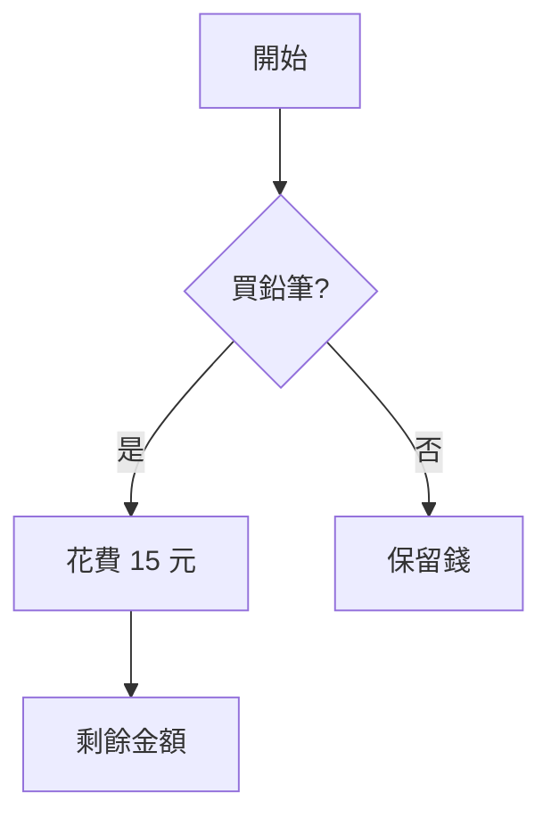
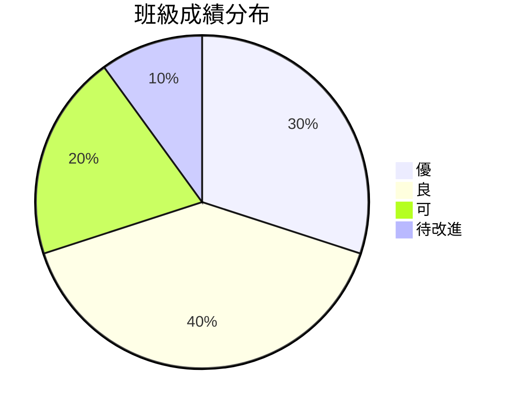

# 如何出有圖形的題目

完整指南：在考卷中加入圖形的所有方法

---

## 📋 目錄

1. [方法總覽](#方法總覽)
2. [方法 1：自動生成圖片（推薦）](#方法-1自動生成圖片推薦)
3. [方法 2：ASCII Art](#方法-2ascii-art)
4. [方法 3：Mermaid 圖表](#方法-3mermaid-圖表)
5. [方法 4：手動繪製圖片](#方法-4手動繪製圖片)
6. [方法 5：AI 生成圖片](#方法-5ai-生成圖片)
7. [實際案例](#實際案例)
8. [常見問題](#常見問題)

---

## 方法總覽

| 方法 | 難度 | 效果 | 適用情境 | 推薦度 |
|------|------|------|----------|--------|
| **自動生成圖片** | ⭐ | ⭐⭐⭐⭐⭐ | 幾何圖形、統計圖表 | ⭐⭐⭐⭐⭐ |
| **ASCII Art** | ⭐ | ⭐⭐ | 簡單座標軸、表格 | ⭐⭐⭐ |
| **Mermaid 圖表** | ⭐⭐ | ⭐⭐⭐⭐ | 流程圖、關係圖 | ⭐⭐⭐⭐ |
| **手動繪製** | ⭐⭐⭐⭐ | ⭐⭐⭐⭐⭐ | 特殊需求 | ⭐⭐⭐ |
| **AI 生成** | ⭐⭐ | ⭐⭐⭐⭐⭐ | 複雜場景、示意圖 | ⭐⭐⭐⭐ |

---

## 方法 1：自動生成圖片（推薦）⭐⭐⭐⭐⭐

### 為什麼推薦？

✅ **零學習成本**：只需一行指令  
✅ **精確專業**：所有尺寸都是精確計算  
✅ **自動化**：可批量生成  
✅ **易於修改**：改參數即可重新生成

### 快速開始

#### 步驟 1：生成圖片

```bash
python3 scripts/generate-geometry-image.py
```

這會自動生成 7 種常用圖形到 `exams/images/` 資料夾。

#### 步驟 2：在 Markdown 中引用

```markdown


根據上圖，已知底邊 8 公分，高 6 公分，求面積。
```

#### 步驟 3：轉換成 PDF

```bash
node scripts/convert-to-pdf.js exams/generated/你的考卷.md
```

### 可生成的圖形類型

| 圖形類型 | Python 函數 | 範例 |
|----------|-------------|------|
| **三角形** | `draw_triangle(base, height)` |  |
| **長方形** | `draw_rectangle(width, height)` |  |
| **圓形** | `draw_circle(radius)` |  |
| **扇形** | `draw_circle(radius, sector_angle)` |  |
| **座標平面** | `draw_coordinate_plane(points)` |  |
| **長條圖** | `draw_bar_chart(data)` |  |
| **複合圖形** | `draw_composite_shape()` |  |

### 自訂圖形

編輯 `scripts/generate-geometry-image.py`，例如：

```python
from scripts.generate_geometry_image import GeometryGenerator

gen = GeometryGenerator()

# 生成一個底邊 10、高 8 的三角形
gen.draw_triangle(base=10, height=8, filename='my-triangle.png')

# 生成一個半徑 7 的圓
gen.draw_circle(radius=7, filename='my-circle.png')

# 生成一個 120° 的扇形
gen.draw_circle(radius=6, sector_angle=120, filename='my-sector.png')
```

---

## 方法 2：ASCII Art

### 適用情境

- 簡單的座標軸
- 表格式資料
- 簡單的示意圖

### 範例

#### 座標平面

```markdown
    y
    |
  5 |       B(3,5)
  4 |     
  3 |   
  2 | A(1,2)
  1 |
    +------------> x
    0   1   2   3   4   5
```

#### 長方形

```markdown
D ----------- C
|           / |
|         /   |  高 = 8 cm
|       /     |
|     /       |
|   /         |
| /           |
A ----------- B
   寬 = 12 cm
```

### 優缺點

✅ **優點**：
- 不需要額外檔案
- 快速繪製
- 適合簡單圖形

❌ **缺點**：
- 不夠精美
- 複雜圖形難以表達
- 列印效果不佳

---

## 方法 3：Mermaid 圖表

### 適用情境

- 流程圖
- 關係圖
- 組織架構圖
- 狀態機

### 範例

#### 流程圖

```markdown

```

#### 圓餅圖

```markdown

```

### 優缺點

✅ **優點**：
- 語法簡單
- 支援多種圖表類型
- 自動排版

❌ **缺點**：
- 不適合幾何圖形
- 需要 Mermaid 渲染器

---

## 方法 4：手動繪製圖片

### 推薦工具

| 工具 | 類型 | 適用情境 |
|------|------|----------|
| **GeoGebra** | 幾何繪圖 | 精確幾何圖形 |
| **Desmos** | 函數繪圖 | 數學函數圖形 |
| **PowerPoint** | 簡報軟體 | 簡單圖形 |
| **Photoshop** | 圖片編輯 | 複雜圖像處理 |
| **Inkscape** | 向量繪圖 | SVG 向量圖 |

### 工作流程

1. 使用工具繪製圖形
2. 匯出為 PNG、JPG 或 SVG
3. 存放到 `exams/images/`
4. 在 Markdown 中引用

```markdown

```

---

## 方法 5：AI 生成圖片

### 使用 DALL-E 或 Midjourney

#### Prompt 範例

```
Generate a simple geometric diagram showing:
- An isosceles triangle with base 8cm and height 6cm
- Label vertices as A, B, C
- Show measurements clearly
- Clean white background
- Educational style
```

#### 使用 Python + PIL

```python
from PIL import Image, ImageDraw, ImageFont

img = Image.new('RGB', (400, 300), 'white')
draw = ImageDraw.Draw(img)

# 繪製三角形
points = [(100, 250), (300, 250), (200, 100)]
draw.polygon(points, outline='black', fill='lightblue')

# 標註
draw.text((190, 90), 'A', fill='black')
draw.text((90, 260), 'B', fill='black')
draw.text((310, 260), 'C', fill='black')

img.save('exams/images/triangle-ai.png')
```

---

## 實際案例

### 案例 1：基礎幾何題

**需求**：出一題三角形面積計算

**方法**：自動生成圖片

```bash
# 1. 生成圖片
python3 scripts/generate-geometry-image.py

# 2. 撰寫題目
```

**Markdown**：
```markdown


已知底邊 8 公分，高 6 公分，求面積。
```

---

### 案例 2：統計圖表題

**需求**：班級成績分布長條圖

**方法**：自動生成長條圖

```python
from scripts.generate_geometry_image import GeometryGenerator

gen = GeometryGenerator()
gen.draw_bar_chart(
    {'0-20': 3, '21-40': 5, '41-60': 10, '61-80': 7, '81-100': 5},
    filename='grade-distribution.png'
)
```

---

### 案例 3：座標平面題

**需求**：兩點中點計算

**方法**：自動生成座標平面

```python
gen.draw_coordinate_plane(
    points={'A': (1, 2), 'B': (3, 5)},
    filename='midpoint-question.png'
)
```

---

## 常見問題

### Q1：圖片在 PDF 中不顯示？

**A**：檢查以下幾點：
1. 圖片路徑是否正確（相對路徑：`../images/xxx.png`）
2. 圖片檔案是否存在
3. 圖片格式是否支援（建議 PNG）

### Q2：圖片太大或太小？

**A**：在 Markdown 中可以調整大小：

```markdown

```

或在 Python 生成時調整 `figsize`：

```python
fig, ax = plt.subplots(figsize=(8, 6))  # 調整尺寸
```

### Q3：中文字無法顯示？

**A**：確認 Python 腳本中已設定字體：

```python
plt.rcParams['font.sans-serif'] = ['Arial Unicode MS', 'Songti SC']
```

### Q4：如何批量生成多個圖形？

**A**：編寫一個迴圈：

```python
gen = GeometryGenerator()

for i in range(1, 11):
    gen.draw_triangle(
        base=5+i, 
        height=3+i, 
        filename=f'triangle-{i}.png'
    )
```

### Q5：可以生成 3D 圖形嗎？

**A**：可以！使用 `mpl_toolkits.mplot3d`：

```python
from mpl_toolkits.mplot3d import Axes3D

fig = plt.figure()
ax = fig.add_subplot(111, projection='3d')
# ... 繪製 3D 圖形
```

---

## 總結與建議

### 推薦工作流程 🎯

1. **日常出題**：使用自動生成圖片（方法 1）
2. **特殊需求**：手動繪製（方法 4）
3. **快速示意**：使用 ASCII Art（方法 2）
4. **流程說明**：使用 Mermaid（方法 3）

### 最佳實踐 ⭐

1. ✅ 圖片統一存放在 `exams/images/`
2. ✅ 檔名使用有意義的命名（如 `triangle-area-q1.png`）
3. ✅ 保持圖片解析度統一（建議 150 DPI）
4. ✅ 使用版本控制管理圖片
5. ✅ 為每個圖片加上 alt 文字（無障礙設計）

### 效率提升技巧 🚀

- 建立圖片範本庫
- 編寫自動化腳本
- 使用 Git 追蹤圖片變更
- 定期清理未使用的圖片

---

## 相關檔案

- **圖片生成腳本**：`scripts/generate-geometry-image.py`
- **圖片儲存位置**：`exams/images/`
- **示範考卷**：
  - `exams/generated/math-exam-with-diagrams-demo.md`
  - `exams/generated/math-exam-with-images.md`

---

**需要協助？**

查看範例檔案或執行：
```bash
python3 scripts/generate-geometry-image.py --help
```
