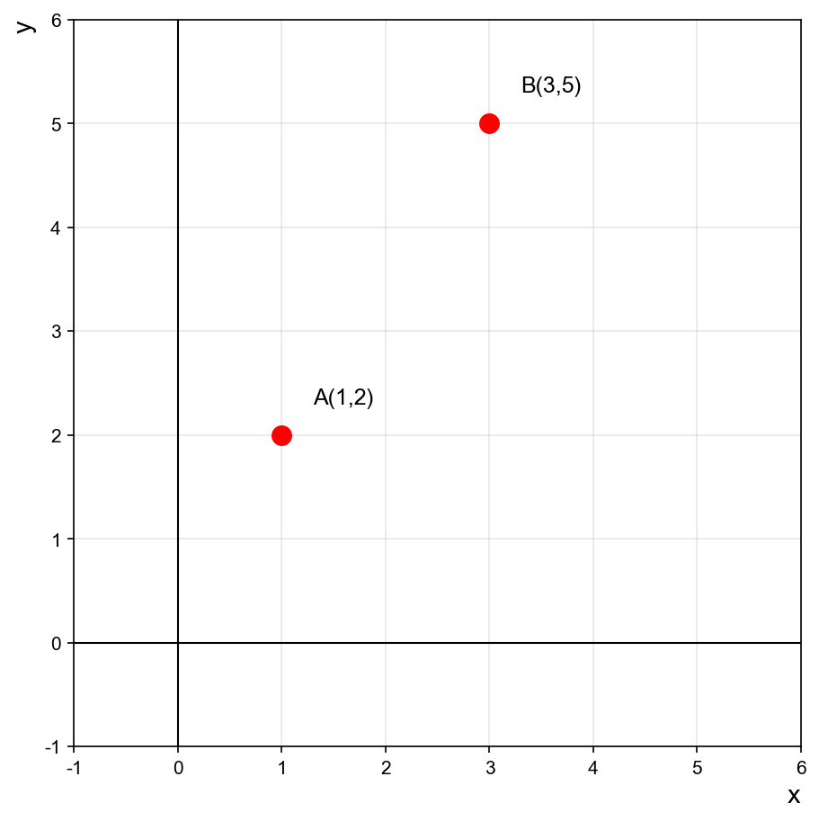
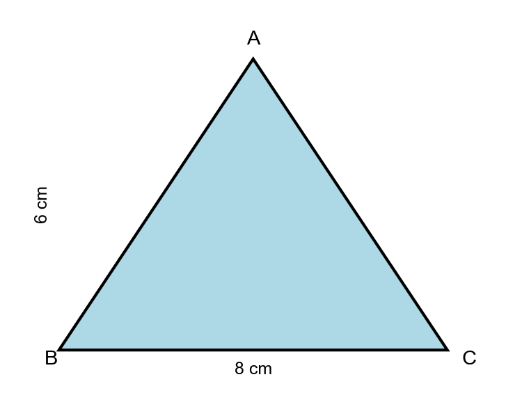
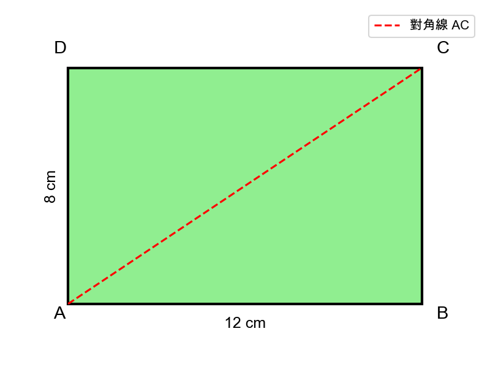
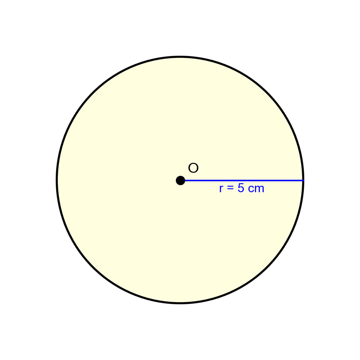
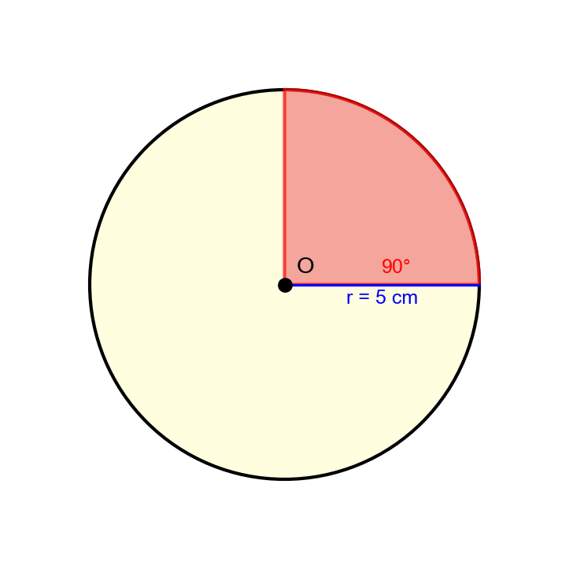
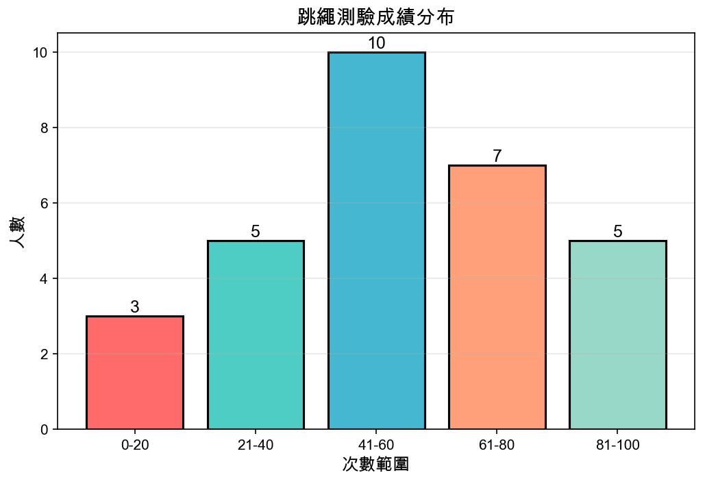
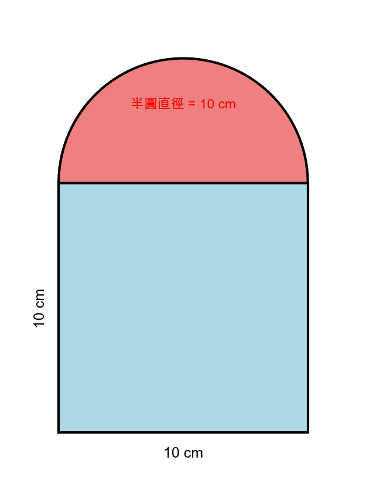

# 私立國中入學模擬考 - 數學科（含圖形題）

- 年級：小六升國一
- 科目：數學
- 題數：10 題
- 測驗時間：20 分鐘
- 滿分：100 分

> 說明：本卷包含多種圖形題型，請仔細觀察圖形後作答。

---

## 三、數學科

### 題目區

1. 請根據下圖回答問題：



點 A 的座標是 (1, 2)，點 B 的座標是 (3, 5)。若線段 AB 的中點為 M，請問 M 的座標是？<br>

   (A) (2, 3)  
   (B) (2, 3.5)  
   (C) (2.5, 3)  
   (D) (2.5, 3.5)

---

2. 請觀察下圖的三角形：



已知底邊長 8 公分，高 6 公分。請問這個三角形的面積是多少平方公分？<br>

   (A) 20 平方公分  
   (B) 24 平方公分  
   (C) 28 平方公分  
   (D) 32 平方公分

---

3. 請觀察下圖的長方形和對角線：



長方形 ABCD 的長 AB = 12 公分，寬 BC = 8 公分。請問對角線 AC 的長度約是多少公分？<br>

   (A) 13.2 公分  
   (B) 14.4 公分  
   (C) 15.6 公分  
   (D) 16.8 公分

---

4. 請觀察下圖的圓形：



已知圓的半徑為 5 公分。請問這個圓的面積約是多少平方公分？（圓周率取 3.14）<br>

   (A) 78.5 平方公分  
   (B) 81.2 平方公分  
   (C) 84.6 平方公分  
   (D) 87.3 平方公分

---

5. 請觀察下圖的扇形：



已知圓的半徑為 5 公分，扇形的圓心角為 90°。請問扇形的面積約是多少平方公分？（圓周率取 3.14）<br>

   (A) 19.625 平方公分  
   (B) 20.125 平方公分  
   (C) 20.625 平方公分  
   (D) 21.125 平方公分

---

6. 請根據下圖的統計資料回答問題：



某班級進行跳繩測驗，成績分布如上圖。請問跳繩次數在 41-60 之間的學生有多少人？<br>

   (A) 5 人  
   (B) 7 人  
   (C) 10 人  
   (D) 12 人

---

7. 承第 6 題，請問跳繩次數在 41-60 之間的學生佔全班的百分比是多少？<br>

   (A) 30%  
   (B) 33.3%  
   (C) 36%  
   (D) 40%

---

8. 請觀察下圖的複合圖形：



一個邊長 10 公分的正方形上方，貼著一個直徑為 10 公分的半圓形。請問整個圖形的周長約是多少公分？（圓周率取 3.14）<br>

   (A) 45.7 公分  
   (B) 46.4 公分  
   (C) 47.1 公分  
   (D) 47.8 公分

---

9. 承第 8 題，請問整個複合圖形的面積約是多少平方公分？（圓周率取 3.14）<br>

   (A) 135.25 平方公分  
   (B) 137.5 平方公分  
   (C) 139.25 平方公分  
   (D) 141.0 平方公分

---

10. 比較：三角形面積（底 8 高 6）、圓形面積（半徑 5）、長方形面積（長 12 寬 8），哪一個最大？<br>

    (A) 三角形  
    (B) 圓形  
    (C) 長方形  
    (D) 一樣大

---

<div style="page-break-after: always;"></div>

## 參考答案

### 數學科答案與解析

| 題號 | 答案 | 配分 | 考點 | 詳細解析 |
|------|------|------|------|----------|
| 1 | (B) | 10 | 座標與中點 | 中點公式：$M = (\frac{x_1+x_2}{2}, \frac{y_1+y_2}{2}) = (\frac{1+3}{2}, \frac{2+5}{2}) = (2, 3.5)$ |
| 2 | (B) | 10 | 三角形面積 | 面積 = $\frac{1}{2} \times 底 \times 高 = \frac{1}{2} \times 8 \times 6 = 24$ 平方公分 |
| 3 | (B) | 10 | 畢氏定理 | $AC = \sqrt{12^2 + 8^2} = \sqrt{144 + 64} = \sqrt{208} \approx 14.4$ 公分 |
| 4 | (A) | 10 | 圓形面積 | 面積 = $\pi r^2 = 3.14 \times 5^2 = 3.14 \times 25 = 78.5$ 平方公分 |
| 5 | (A) | 10 | 扇形面積 | 面積 = $\frac{90}{360} \times \pi r^2 = \frac{1}{4} \times 78.5 = 19.625$ 平方公分 |
| 6 | (C) | 10 | 讀圖能力 | 從長條圖直接讀取，41-60 區間有 10 人 |
| 7 | (B) | 10 | 百分比計算 | 全班 = $3+5+10+7+5 = 30$ 人。$\frac{10}{30} = 33.3\%$ |
| 8 | (A) | 10 | 複合圖形周長 | 周長 = 正方形三邊 + 半圓周長 = $10+10+10+\pi \times 5 = 30+15.7 = 45.7$ 公分 |
| 9 | (C) | 10 | 複合圖形面積 | 面積 = 正方形 + 半圓 = $10^2 + \frac{1}{2}\pi \times 5^2 = 100 + 39.25 = 139.25$ 平方公分 |
| 10 | (C) | 10 | 面積比較 | 三角形 24，圓形 78.5，長方形 96。長方形最大 |

---

## 圖形說明

本考卷使用的所有圖形均由 Python + Matplotlib 自動生成，具備以下特色：

✅ **精確繪製**：所有尺寸和角度都經過精確計算  
✅ **清楚標註**：頂點、邊長、角度都有明確標示  
✅ **彩色呈現**：不同圖形使用不同顏色，易於辨識  
✅ **高解析度**：150 DPI 輸出，列印清晰

---

## 生成圖形的方法

如果你想要自己生成圖形，可以使用：

```bash
python3 scripts/generate-geometry-image.py
```

這個腳本可以生成：
- 三角形
- 長方形
- 圓形與扇形
- 座標平面
- 統計圖表
- 複合圖形

所有圖形都會自動儲存到 `exams/images/` 資料夾。
